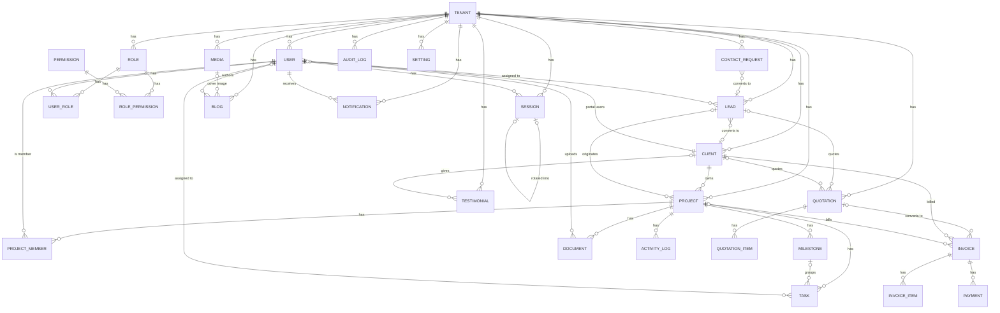

# Database Schema (Phase 1.1A) — Prisma Physical Design

Companion to `database.md` (the conceptual/prose brief) and the physical
implementation of it: `apps/api/prisma/schema.prisma`. `database.md` stays the
source of truth for *why*; this doc is the source of truth for *what got built*
and *why it deviates* where it does.

**Status:** schema only, validated (`pnpm --filter @antrique/api db:validate`).
No migrations, no seed data, no wired-up `PrismaClient`, no RLS policy SQL yet —
all deferred to Phase 1.1B per the task boundary. See "Deferred to Phase 1.1B"
at the end of this doc for the full list.

## 1. ER Diagram



*(Every entity above also has an implicit `tenant_id → TENANT` edge, omitted
per-row to keep the diagram legible — see §3 Multi-tenant strategy.)*

## 2. Model relationship summary

| Domain | Models | Key relationships |
|---|---|---|
| **Tenancy & access control** | Tenant, User, Role, Permission, UserRole, RolePermission, Session | `Permission` is the only non-tenant-scoped table (global catalog). RBAC chain: `Permission → RolePermission → Role (per tenant) → UserRole → User`. `Session` tracks this app's own refresh tokens post-IdP-auth, with a self-relation (`replacedBySessionId`) for rotation/reuse-detection. This RBAC chain's first real application-layer reader is **Milestone 3 (Role & Permission Foundation)** — `apps/api/src/authorization/` queries it (`RoleRepository`/`PermissionRepository`) to back `RolesGuard`/`PermissionsGuard`; the schema itself is unchanged, no migration needed. |
| **CRM** | ContactRequest, Lead, Client | Funnel: `ContactRequest → Lead → Client`, each step optional (a Lead can arrive without a prior ContactRequest; a Client can exist without ever being a Lead — e.g. entered directly by sales). `Client` is the agency's *own* customer org, distinct from `Tenant` (the platform isolation boundary) — see §3. |
| **Delivery** | Project, ProjectMember, Milestone, Task, Document | `Project` belongs to a `Client` (required) and optionally traces back to the originating `Lead`. `Task` is finer-grained than `Milestone` and optionally nests under one. `ProjectMember` and `Document.uploadedBy` are how `User` connects to delivery work. |
| **Commerce** | Quotation, QuotationItem, Invoice, InvoiceItem, Payment | `Quotation`/`Invoice` are header+line-item pairs (see §4 for why line items were added beyond the literal model list). `Invoice.quotationId` traces lineage from an accepted quote. `Payment` is append-only — one row per gateway webhook event, never mutated. |
| **Content / CMS** | Media, Blog, Testimonial | `Media` is the CMS asset library (independent from delivery `Document`s). `Blog.coverMediaId` links to it. `Testimonial.clientId` is optional (a testimonial can cite an unlinked author). |
| **Platform** | Notification, ActivityLog, AuditLog, Setting | `ActivityLog` (human-readable feed) and `AuditLog` (immutable compliance trail) are deliberately separate — see §4. `Setting` holds non-secret tenant config only. |
| **Catalog** (Milestone 5) | Category, Collection, Product, ProductVariant, ProductImage | Genuinely new schema this milestone (unlike Milestones 3/4, which found their target entities already modeled) — migration `20260720190000_add_product_catalog`. `Product` optionally belongs to one `Category` and one `Collection` (both simple one-to-many — no join table, no hierarchy). `ProductVariant`/`ProductImage` are line-item-shaped like `QuotationItem`/`InvoiceItem` (`createdAt`/`updatedAt` only, Cascade-deleted with their parent `Product`, no independent soft-delete/version) — neither has its own repository/controller; both are written only as nested Prisma creates under `POST /products`. No design guidance existed in `docs/product/` for this domain — flagged, not silently assumed (see `apps/api/src/modules/catalog/README.md`). |
| **Bespoke Customizer** (Milestone 6) | FabricCategory, Fabric, FabricImage, ProductFabric, MeasurementProfile, Measurement, StyleOptionGroup, StyleOption, StyleOptionIncompatibility, ProductCustomization, PricingAdjustment, MonogramOption | 12 new tables — 10 named "core entities" plus `ProductFabric`/`StyleOptionIncompatibility`, both structurally-required joins not individually named in this milestone's brief (see each model's own schema.prisma comment) — migration `20260720200000_add_bespoke_customizer`. `ProductCustomization` is 1:1 with `Product` (`productId` is `@unique`, a true 1:1 Prisma's own relation validator requires); `Product ↔ Fabric` is many-to-many via `ProductFabric` (a fabric like "Navy Wool Twill" is reusable across many products, unlike Category/Collection's simple one-to-many). `FabricImage`/`StyleOptionGroup`/`PricingAdjustment`/`MonogramOption` are line-item-shaped like `ProductVariant`/`ProductImage` (no independent repository/controller); `StyleOption`/`Fabric`/`MeasurementProfile`/`FabricCategory` get full audit/soft-delete treatment (the first three have standalone controllers; `FabricCategory` doesn't yet but is schema'd consistently for one). No design guidance existed in `docs/product/` for this domain either — checked fresh, not assumed from Milestone 5's own finding (see `apps/api/src/modules/bespoke/README.md`). |
| **Inventory & Stock Management** (Milestone 7) | Warehouse, InventoryItem, InventoryTransaction, InventoryReservation, Supplier, SupplierProduct | 6 new tables — migration `20260721100000_add_inventory_management`. `InventoryItem`/`SupplierProduct` both reference EITHER a `ProductVariant` OR a `Fabric`, never both — a hand-written cross-column `CHECK` constraint mirroring the existing `Quotation.leadId`/`clientId` XOR precedent (`20260717091000_check_constraints`), extended from a lead-vs-client choice to a variant-vs-fabric one. `InventoryTransaction` is the one genuinely append-only table in this whole schema — `createdAt` only, no `updatedAt`/soft-delete/version, since "Transactions are append-only" is this milestone's own explicit business rule, not just a convention. `InventoryItem.onHand`/`reserved` are persisted running counters (`Decimal(12,3)`, not `(12,2)` like money — fabric stock is realistically fractional); `Available = OnHand − Reserved` is computed at read time, never stored. `reserved <= on_hand` and `on_hand >= 0` are hand-written `CHECK` constraints — the database-level backstop behind `InventoryService`'s own pre-checks for "Prevent negative stock"/"Prevent over-reservation." No design guidance existed in `docs/product/` for this domain either (see `apps/api/src/modules/inventory/README.md`). |
| **Order Management & Checkout** (Milestone 8) | Customer, CustomerAddress, Order, OrderItem, OrderStatusHistory, PaymentRecord | 6 new tables, 1 new enum (`OrderStatus`) — migration `20260722090000_add_order_management`. `Customer` is distinct from both `Client` (the agency's own B2B customer org) and `User` (portal/staff accounts), though it may optionally link to one via `userId`. `OrderStatusHistory` is the second genuinely append-only table in this schema (after `InventoryTransaction`) — `createdAt` only, "No status mutation without history" is this milestone's own explicit business rule, enforced structurally. `OrderItem`/`CustomerAddress` are line-item-shaped like `ProductVariant`/`ProductImage` (no independent repository/controller); `OrderItem.inventoryReservationId` is `@unique`, linking each line to the real `InventoryReservation` `OrderService` created for it (the same row order cancellation walks to release stock). `PaymentRecord` is a placeholder only — no service/controller/repository, purely a schema anchor for the payment-gateway-integration milestone this one's own "Do NOT Implement" list explicitly defers. Non-negative `CHECK` constraints on `orders.subtotal`/`total`, `order_items.unit_price`/`line_total`, `payment_records.amount`, plus a positive-quantity check on `order_items.quantity`. No design guidance existed in `docs/product/` for this domain either (see `apps/api/src/modules/orders/README.md`). |
| **CRM & Customer Operations** (Milestone 9) | LeadSource, CustomerNote, CustomerActivity, FollowUpTask, CustomerTag, CustomerTagAssignment — plus 2 additive columns + 1 new enum value on the EXISTING `Lead` | 6 new tables, 2 new enums (`CustomerActivityType`, `FollowUpStatus`) — migration `20260722100000_add_crm_customer_operations`. Architecture audit found `Lead` (Phase 1.1A) already fully modeled with zero application-layer consumers — reused wholesale, not duplicated; `Lead.leadSourceId` (→ `LeadSource`, additive alongside the existing free-text `source` column) and `Lead.convertedCustomerId` (→ the NEW `Customer`, kept deliberately separate from the pre-existing `Lead.convertedClientId` → `Client`) are the only two new columns, plus `LeadStatus.ARCHIVED`. `CustomerActivity.customerId` is NULLABLE — "lead creation" fires before any Customer exists, so that trigger's own row is anchored by `relatedLeadId` alone (caught and fixed before any code depended on the wrong, required shape — see `docs/implementation/decisions.md`); it's the third genuinely append-only table in this schema (after `InventoryTransaction`/`OrderStatusHistory`). `FollowUpTask` references EITHER a `Lead` OR a `Customer`, never both — a hand-written cross-column `CHECK` constraint (`follow_up_tasks_lead_xor_customer_check`) mirroring the existing `Quotation.leadId`/`clientId` XOR precedent, extended from a lead-vs-client choice to a lead-vs-customer one. `CustomerTagAssignment` is a pure join with no soft-delete column (unassign is a real `DELETE`, same treatment `ProductFabric` already established). No design guidance existed in `docs/product/` for this domain either (see `apps/api/src/modules/crm/README.md`). |
| **Payments & Billing Foundation** (Milestone 10) | TaxRate, PaymentMethod, PaymentAllocation — plus additive columns on the EXISTING `Invoice`/`Payment` | 3 new tables — migration `20260722110000_add_payments_billing_foundation`. Architecture audit found `Invoice`/`InvoiceItem`/`Payment`/`Quotation`/`QuotationItem` (Phase 1.1A/1.1B) already fully modeled with zero application-layer consumers — notably, `invoices_amount_paid_check` (`20260717091000_check_constraints`) already enforced "Paid amount never exceeds invoice total," and `payments` already had `UPDATE`/`DELETE` revoked at the database-privilege level (`20260717091500_row_level_security`), both before any application code existed. `Invoice.clientId` (the pre-existing agency-billing path → `Client`) relaxed from required to nullable, gaining NEW `customerId`/`orderId` (→ Milestone 8's `Customer`/`Order`, "Invoices belong to Orders") and `taxRateId` — kept deliberately separate from `clientId`, the same "two independent paths on one shared entity" pattern Milestone 9 established for `Lead`. Two new `CHECK` constraints: `invoices_client_xor_customer_check` (mirroring `quotations_lead_xor_client_check`) and `invoices_order_requires_customer_check`. `Payment.invoiceId`/`provider`/`providerRef` (the pre-existing gateway-webhook-event shape) relaxed to nullable, gaining NEW `paymentMethodId`/`method`/`reference` for this milestone's own manually-recorded-payment flow; the new `PaymentAllocation` table is the actual invoice-by-invoice ledger, given the SAME database-privilege-level `UPDATE`/`DELETE` revoke `payments` already has (`payment_allocations_amount_check` enforces a positive amount). `PaymentMethod` gets a hand-written partial unique index on soft-deletable `(tenantId, slug)`. No design guidance existed in `docs/product/` for this domain either (see `apps/api/src/modules/billing/README.md`). |
| **Admin Platform, Analytics & Notifications** (Milestone 11) | NotificationTemplate, SystemEvent, DashboardWidget, ScheduledReport — plus additive columns on the EXISTING `Notification` | 4 new tables, 4 new enums (`NotificationStatus`, `SystemEventSeverity`, `DashboardWidgetType`, `ReportType`) — migration `20260722120000_add_admin_platform_analytics_notifications`. Architecture audit found `Notification`/`AuditLog` (Phase 1.1B) already fully modeled with zero application-layer consumers; `AuditLog` needed ZERO schema changes (pure reuse — its pre-existing `UPDATE`/`DELETE` revoke already enforced "Immutable audit history"). `Notification` gained an additive DELIVERY-state lifecycle it never had (`status`/`sentAt`/`failedAt`/`retryCount`/`lastError` — the pre-existing columns only tracked recipient interaction via `readAt`/`dismissedAt`). `SystemEvent` is the fourth genuinely append-only table in this schema (after `InventoryTransaction`/`OrderStatusHistory`/`CustomerActivity`) — a generic, tenant-scoped operational ledger distinct from both `AuditLog` (compliance/security, actor-centric) and `ActivityLog` (project-scoped human timeline). `NotificationTemplate`/`DashboardWidget` both get hand-written partial unique indexes on their own soft-deletable key columns (`(tenantId, key, channel)` / `(tenantId, key)`). `system_events`/`scheduled_reports` get the SAME database-privilege-level `UPDATE`/`DELETE` revoke `payments`/`audit_logs`/`payment_allocations` already have. No design guidance existed in `docs/product/` for this domain either (see `apps/api/src/modules/admin/README.md`). |

## 3. Multi-tenant strategy

- **`tenant_id` is on every table except `permissions`.** This is more
  aggressive than exposing it in the API (several tables — `Milestone`,
  `Task`, `Document`, the join tables — don't expose `tenant_id` in their
  OpenAPI JSON shape, since it's inferable via their parent `Project`/`Role`).
  It's still stored as a real column on every row so RLS policies (Phase
  1.1B) can filter *every* table directly on `tenant_id` without a join,
  and so every index that needs tenant-scoped performance has it available.
  This is the literal reading of `database.md`'s "tenant_id is the spine of
  every table, index, and access rule."
- **RLS itself is not in this file.** Prisma's schema DSL has no way to
  express Postgres `CREATE POLICY` statements — RLS is pure SQL, applied as
  a migration (Phase 1.1B, `database/policies/` per the existing repo
  scaffold), not something `schema.prisma` can declare. This schema's job is
  to make sure every table *has* the column RLS will key off; enabling RLS
  and writing the actual policies is explicitly out of scope here.
- **`Tenant` vs `Client` — two different multi-tenancy concepts.** `Tenant`
  is the platform's isolation boundary (today: one Antrique instance; the
  schema doesn't preclude onboarding a second agency as a second tenant
  later). `Client` is *that tenant's own customer* — the organization a
  Project/Invoice/Quotation belongs to. Conflating them would mean every one
  of Antrique's customers needs full RLS-level isolation from each other,
  which is far stronger (and more expensive) than what the product actually
  needs — client-side portal users just need to see only *their own*
  Client's data, which `User.clientId` + application-layer scoping handles
  without a second RLS dimension.
- **Consistency at insert time.** Rows whose `tenant_id` is derived from a
  parent (`Milestone.tenantId` from `Project.tenantId`, etc.) rely on the
  application layer setting it correctly on insert. Not from a JWT tenant
  claim — Milestone 4 (Organization & Multi-Tenant Foundation) deliberately
  does NOT add tenant information to the JWT (that milestone's own explicit
  requirement); the tenant comes from the request's resolved `TenantContext`
  instead (`apps/api/src/tenant/` — hostname → `X-Tenant-ID` header →
  `DEFAULT_TENANT_ID` dev-only fallback, see §10). There's no cross-table
  CHECK constraint enforcing `Milestone.tenant_id = Project.tenant_id` in
  Postgres either way. This is a known, accepted gap belt-and-suspenders-
  wise: RLS is still the real backstop (a row with a wrong tenant_id would
  just be invisible/inaccessible to the wrong tenant, not silently leaked),
  consistent with `CLAUDE.md`'s "RLS is the backstop, not the only gate."

## 3.1. Referential actions (`onDelete`)

**Phase 1.1A review finding, now fixed:** the original pass defined every
relation without an explicit `onDelete`, so all 62 foreign keys fell back to
Prisma's implicit per-relation default. That silently left `database.md`'s
explicit deletion-behavior policy ("content follows its project via cascade
soft-delete; money + audit never cascade — restrict; lead→project set-null")
unimplemented at the one layer (`schema.prisma`) capable of expressing it —
`onDelete` is standard Prisma DSL, not one of the raw-SQL-only items in §5.
Every relation now carries an explicit action, by category:

| Category | Action | Applies to |
|---|---|---|
| Every relation to `Tenant` | `Restrict` | All 27 tenant-scoped models — never let an FK cascade a tenant hard-delete; tenant offboarding must be a deliberate, explicit operation, not a side effect of a `DELETE`. |
| Required relation to a real business parent | `Restrict` | e.g. `Project.client`, `Task.project`, `Invoice.client`, `Payment.invoice` (the literal "money never cascades" case from `database.md`). Forces the app layer to soft-delete (the product's actual delete UX) instead of a hard delete silently orphaning or nuking child rows. |
| Optional (nullable) FK | `SetNull` | e.g. `Project.lead` (the literal "lead→project set-null" case), `Task.assignee`, `Document.uploadedBy`, `Blog.author`, `AuditLog.actor`. Generalizes the one example `database.md` gave to every other optional reference — a referenced row disappearing shouldn't take the referencing row down with it. |
| Pure join-table rows | `Cascade` | `UserRole`/`RolePermission`/`ProjectMember` → their non-tenant parents (`User`, `Role`, `Permission`, `Project`). A join row has no meaning once either side of the pairing is gone; this is the standard bridge-table pattern and the one place `database.md`'s "join tables hard-delete" already implies cascade. |
| Ephemeral auth artifact | `Cascade` | `Session.user` — a session is derived, short-lived login state, not a business record; stale sessions shouldn't block deleting a user. (`Session.tenant` and `Session.replacedBySession` stay `Restrict`/`SetNull` per the general rules.) `Session` also picked up a generic `updatedAt` in the second review pass — it already had `version` (optimistic lock) and semantic timestamps (`lastUsedAt`, `revokedAt`), but no field answered "when was this row last touched" generically, which operational tooling (stale-session cleanup jobs, anomaly detection) needs. |
| Owned line item | `Cascade` | `QuotationItem.quotation`, `InvoiceItem.invoice` — a line item has zero standalone meaning without its parent, unlike `Document`/`Task`, which keep independent audit value under the product's normal soft-delete flow. |

Note this governs **hard**-delete referential integrity only; the product's
actual delete UX is soft-delete (`deleted_at`) almost everywhere, so these
actions are the safety net for the rarer hard-delete paths (data-retention
purges, GDPR/DPDP erasure, admin cleanup scripts) rather than everyday
traffic.

## 4. Index strategy

Applied uniformly across all 27 models:

1. **`@@index([tenantId])`** on every tenant-scoped table — the base
   isolation-scan index, since every query is tenant-filtered.
2. **`@@index([tenantId, status])`** wherever a status enum is the primary
   filter (Lead, Project, Milestone, Task, Quotation, Invoice, Payment,
   Document, ContactRequest, Blog, Testimonial, Client) — matches
   `database.md`'s explicit `(tenant_id, status)` pattern.
3. **`@@index([tenantId, createdAt])`** for time-range listing/pagination —
   on the highest-traffic append-heavy tables (Invoice, Payment,
   ActivityLog, AuditLog, Notification, Project, Lead, ContactRequest).
4. **Explicit FK indexes** on every foreign key — Postgres does **not**
   auto-index foreign key columns (only primary keys), so every `xxxId`
   scalar gets its own `@@index` unless already covered by a composite
   index leading with it (e.g. `Task.projectId`, `Task.milestoneId`,
   `Task.assigneeId`, `Invoice.clientId`, `Invoice.projectId`, etc.).
5. **Join-table reverse indexes.** A composite PK like `UserRole
   @@id([userId, roleId])` efficiently answers "roles for user X" but not
   "users with role Y" — every join table (`UserRole`, `RolePermission`,
   `ProjectMember`) gets an extra `@@index` on its second PK column.
6. **`providerRef` on `Payment`** — `@@unique([tenantId, providerRef])`,
   matching `database.md`'s explicit call-out, scoped per-tenant rather than
   globally (safer default if a tenant ever uses a sandbox/test gateway
   account whose refs could collide with another tenant's).
7. **Phase 1.1A review additions** — composite indexes for query patterns
   the original pass missed, all backing dashboards the product docs
   describe (delivery-console task lists, upcoming-milestone views,
   overdue-invoice billing runs, payment reconciliation):
   - `Task`: `@@index([tenantId, dueDate])` (upcoming/overdue task scans)
     and `@@index([assigneeId, status])` ("my open tasks" — the single most
     common portal/delivery-console query, previously only servable by
     scanning all of a user's tasks and filtering status in memory).
   - `Milestone`: `@@index([tenantId, dueDate])` (upcoming-milestone widget).
   - `Invoice`: `@@index([tenantId, dueDate])` (overdue-invoice billing runs
     — `InvoiceStatus.OVERDUE` exists but nothing indexed the field that
     actually drives "what's overdue" other than a full status scan).
   - `Payment`: `@@index([tenantId, status])` — item 2 above already
     *claimed* Payment followed the schema-wide `(tenant_id, status)`
     pattern, but the index itself was missing from `schema.prisma` (a
     doc/schema drift caught in the second review pass); added so
     reconciliation queries ("all FAILED payments this week") don't force a
     full tenant scan.

   **Reviewed and deliberately left alone:** the plain `@@index([tenantId])`
   that coexists with `@@index([tenantId, status])` / `@@index([tenantId,
   createdAt])` on the same table looks redundant at first glance (Postgres
   can serve a tenant_id-only equality lookup from the leftmost prefix of
   either composite). It's kept because Phase 1.1B's RLS policies filter
   *every* query by `tenant_id` regardless of the query's own predicates,
   and some real query shapes (bulk export, admin cross-tenant tooling,
   `COUNT(*)` widgets) filter on tenant_id alone — a narrower single-column
   index serves those faster and smaller than reusing a wider composite.
   Recommend confirming with `pg_stat_user_indexes` after Phase 1.1B ships
   real traffic rather than removing pre-emptively.

## 5. Design rationale

### Deviations from the literal 25-model list
- **Added `QuotationItem` and `InvoiceItem`.** The task asked to "normalize
  the schema appropriately," and a single `amount` column on Quotation/
  Invoice can't represent a multi-line quote or invoice without either (a) a
  denormalized JSON blob — which `database.md` reserves for tenant-specific
  *custom* fields, not core structured business data — or (b) losing
  per-line detail entirely. Two small child tables were the smaller
  deviation. If you'd rather stay at exactly 25 models, these collapse
  cleanly into a `lineItems Json` field on each parent — flag it and I'll
  swap it.
- **Phase 1.1A review fix: `QuotationItem`/`InvoiceItem` had no `createdAt`/
  `updatedAt` at all** — the only two models in the schema with zero audit
  timestamps, despite being financial records. Added both (not the full
  `createdBy`/`updatedBy`/`version`/soft-delete block — these stay lighter
  than a general business entity, consistent with how they're always
  mutated as part of their parent Quotation/Invoice's own edit, never
  independently).

### Fields added beyond what's in the OpenAPI contract or product docs
Several fields exist only because the entity can't function without them,
even though no doc mentions them explicitly:
- **`User.idpSubject`** — the linkage key to the external managed IdP.
  Without it there's no way to resolve an incoming JWT to a `User` row.
  **Amendment (Milestone 1 — Real Authentication):** `idpSubject` became
  optional and a sibling `passwordHash` column was added — the original
  IdP-only design didn't account for local email+password auth, which
  security.md's "Auth" line now documents as a second, independent
  credential path. Both fields are nullable; a `User` needs at least one
  populated, not enforced at the schema level (see schema.prisma's `User`
  model comment). Full rationale: docs/implementation/decisions.md.
- **`User.firstName`/`lastName`** — the OpenAPI `User` schema has no name
  field at all (only email/status/role_ids); a real admin UI needs
  *something* to display. Worth a follow-up OpenAPI update.
- **`Session`** (the whole model) — implied by security.md's "rotating
  refresh (reuse detection)" but not spelled out as a table anywhere.
- **`Lead.assignedToUserId`, `Quotation.preparedById`** — standard CRM
  sales-ownership fields, directly implied by "CRM lead pipeline" but not
  itemized in any doc.

### Why `ActivityLog` and `AuditLog` are separate tables
Easy to conflate — both are event logs. `AuditLog` is the immutable,
before/after, IP/UA-stamped compliance trail from `database.md`, visible
only to admins. `ActivityLog` is the human-readable business timeline
("Milestone X approved by Y") that powers the client portal's project
timeline and an admin activity feed — it doesn't need to capture every field
diff, just a friendly summary. Merging them would force the compliance trail
to carry UI-summary text, or force the UI feed to parse raw before/after
JSON diffs on every render.

### Known Prisma schema-DSL limitations (deferred to Phase 1.1B migrations)
Prisma's schema language cannot express these — each is called out with a
`NOTE (Phase 1.1B)` comment at its exact location in `schema.prisma`:
- **Partial/filtered unique indexes.** `database.md` requires uniqueness
  scoped to live rows only (e.g. `(tenant_id, email) WHERE deleted_at IS
  NULL`, so a soft-deleted user's email can be reused). Prisma's `@@unique`
  can't express the `WHERE` clause — every soft-deletable unique constraint
  in this schema (`User.email`, `Role.key`, `Quotation.quotationNumber`,
  `Invoice.invoiceNumber`, `Blog.slug`, `Setting.key`) is a stand-in that
  will need a raw-SQL partial index in the first migration, replacing the
  Prisma-generated full-table unique index.
- **CHECK constraints.** All need raw SQL `ALTER TABLE ... ADD CONSTRAINT
  ... CHECK (...)`, not expressible in `schema.prisma`. Full list as of the
  Phase 1.1A review (the original doc only named two — expanded here so
  Phase 1.1B has a complete worklist instead of rediscovering these mid-
  migration):
  - Non-negative money: `Quotation`/`Invoice` `subtotal_amount`,
    `tax_amount`, `discount_amount`, `total_amount`, `Invoice.amount_paid`;
    `QuotationItem`/`InvoiceItem` `unit_price`, `amount`; `Payment.amount`.
  - Non-negative/positive quantities: `QuotationItem`/`InvoiceItem`
    `quantity > 0`, `sort_order >= 0`.
  - Bounded range: `Testimonial.rating BETWEEN 1 AND 5` (nullable column —
    constraint must allow `NULL`).
  - Cross-column: exactly one of `Quotation.lead_id`/`client_id` set.
  - Consider (lower priority, confirm during 1.1B): `Invoice.amount_paid <=
    total_amount`, `Session.expires_at > issued_at`.
- **Row-Level Security.** Entirely raw SQL (`ALTER TABLE ... ENABLE ROW
  LEVEL SECURITY; CREATE POLICY ...`), per §3 above.

### A Prisma 7 architectural note worth flagging
Prisma 7 (installed: `7.8.0`) removed the `url` field from the `datasource`
block in `schema.prisma` — connection strings now live in a separate
`prisma.config.ts` at the app root, read by the CLI/Client at runtime rather
than declared in the schema file. That file doesn't exist yet — it's the
first thing Phase 1.1B needs, since `prisma migrate`/`prisma generate` won't
run without it. Schema *validation* (what this deliverable needed) doesn't
require it, which is why `schema.prisma` here only declares `provider =
"postgresql"` with no `url`.

## 6. Validation

```
$ pnpm --filter @antrique/api db:validate
Prisma schema loaded from prisma\schema.prisma.
The schema at prisma\schema.prisma is valid 🚀

$ pnpm --filter @antrique/api db:format
Prisma schema loaded from prisma\schema.prisma.
Formatted prisma\schema.prisma in 184ms 🚀
```

Full workspace `lint`/`typecheck`/`format:check` re-run clean after adding
`prisma` as an `apps/api` devDependency (schema-authoring tooling only — no
`@prisma/client`, no generated client, no NestJS wiring).

Re-validated after the Phase 1.1A final review, first pass (onDelete
actions, new indexes, QuotationItem/InvoiceItem timestamps):

```
$ pnpm --filter @antrique/api db:validate
Prisma schema loaded from prisma\schema.prisma.
The schema at prisma\schema.prisma is valid 🚀

$ pnpm --filter @antrique/api db:format
Prisma schema loaded from prisma\schema.prisma.
Formatted prisma\schema.prisma in 134ms 🚀
```

Re-validated again after the second review pass (Session.updatedAt,
Payment status index):

```
$ pnpm --filter @antrique/api db:format
Prisma schema loaded from prisma\schema.prisma.
Formatted prisma\schema.prisma in 143ms 🚀

$ pnpm --filter @antrique/api db:validate
Prisma schema loaded from prisma\schema.prisma.
The schema at prisma\schema.prisma is valid 🚀
```

## Deferred to Phase 1.1B (explicitly out of scope for this doc)
- `prisma.config.ts` + first migration (`prisma migrate dev`)
- Raw-SQL partial unique indexes, CHECK constraints, RLS policies (§5, §3.1
  note on hard-delete-only scope)
- Seed data (default roles/permissions — belongs to the separate "RBAC
  model" sprint task, not schema/migrations)
- Wiring `PrismaService`/`PrismaModule` into NestJS, and any repository code

**Status: implemented.** Everything on this list is done as of Phase 1.1B —
see §8–§13 below (migration strategy, RLS strategy, seed strategy, setup
instructions, local dev workflow, validation results). The one item that
stayed out of scope on purpose: wiring `PrismaService`/`PrismaModule` into
NestJS is still Phase 1.2+ (this phase is database infrastructure only).

## 7. Phase 1.1A final review report (2026-07-16, verified 2026-07-17)

Principal-database-architect pass over the full schema and this doc before
sign-off, against: normalization, relationships, FKs, PKs, composite
indexes, unique constraints, enums, multi-tenancy, soft delete, audit
fields, optimistic locking, monetary precision, naming consistency,
scalability, performance, referential integrity — plus the required-field
checklist (id/tenantId/createdAt/updatedAt/deletedAt/createdBy/updatedBy/
deletedBy/version) on every model. Run as two passes: the second re-derived
required-field coverage per model programmatically (rather than trusting
the first pass's manual read) and re-checked the `(tenant_id, status)`
index claim in §4 item 2 against the actual schema, which is how the
`Session.updatedAt` and `Payment` status-index gaps below surfaced.

**✅ Improvements applied**
- Added explicit `onDelete` referential actions to all 62 foreign-key
  relations (previously none — see §3.1). This was the one place
  `database.md`'s documented deletion-behavior policy was expressible in
  `schema.prisma` but hadn't actually been written down.
- Added `createdAt`/`updatedAt` to `QuotationItem` and `InvoiceItem` — the
  only two models in the schema with zero audit timestamps.
- Added `updatedAt` to `Session` — it already had `version` and semantic
  timestamps (`lastUsedAt`, `revokedAt`) but nothing answered "when was
  this row last touched" generically (session-cleanup jobs, anomaly
  detection).
- Added five composite indexes for previously-unindexed, doc-implied query
  patterns: `Task(tenantId, dueDate)`, `Task(assigneeId, status)`,
  `Milestone(tenantId, dueDate)`, `Invoice(tenantId, dueDate)`, and
  `Payment(tenantId, status)` (§4 already *described* this last one as
  schema-wide before the review — the column pair was documented but
  missing from `schema.prisma` itself; second-pass drift check caught it).
- Expanded the CHECK-constraint worklist for Phase 1.1B from 2 items to a
  complete list covering every money/quantity/range/cross-column case in
  the schema (§5), so it isn't rediscovered mid-migration.
- Re-validated (`db:validate`) and re-formatted (`db:format`) clean after
  both passes.

**⚠ Design recommendations (not applied — judgment calls for Phase 1.1B or later, not blockers)**
- `Permission.updatedAt` is absent — consistent with it being seed-only/
  non-user-editable today, but if a future admin UI ever allows editing a
  permission's `description`, add it then.
- The coexistence of `@@index([tenantId])` with wider composites starting
  `tenantId` on the same table (Lead, Project, Invoice, etc.) is
  intentional, not redundant — see §4 item 7 for why, and revisit with real
  `pg_stat_user_indexes` data post-launch rather than trimming now.
- `Quotation.notes` has no `Invoice` equivalent — not grounded in any
  product doc, so not added speculatively; flag if the billing team wants
  invoice-level notes.
- `Session` still has no `createdBy`/`updatedBy` (self-issued at login, not
  admin-authored) and no soft-delete (`revokedAt` already serves that role)
  — reviewed and confirmed as intentional, not a gap; only the generic
  `updatedAt` was missing, and that's now fixed.

**❌ Remaining limitations that require Phase 1.1B**
- Partial/filtered unique indexes (`WHERE deleted_at IS NULL`) — Prisma's
  `@@unique` can't express them; today's `@@unique` is a stand-in that will
  incorrectly block reusing a value (email, slug, key, invoice/quotation
  number) after a soft delete until replaced by raw SQL.
- All CHECK constraints (§5's expanded list) — no non-negative-money,
  positive-quantity, rating-range, or cross-column enforcement exists at
  the DB layer yet; the app layer is the only gate until migrations land.
- Row-Level Security — no tenant isolation is enforced by Postgres itself
  yet; `tenant_id` columns and indexes are in place, but until RLS policies
  are written, tenant scoping is 100% dependent on the application layer
  getting every query right.
- `prisma.config.ts` doesn't exist — `prisma migrate`/`prisma generate`
  cannot run until Phase 1.1B creates it (Prisma 7 moved the datasource
  `url` out of `schema.prisma`).
- Cross-table `tenant_id` consistency (e.g. `Milestone.tenant_id` must
  equal its `Project.tenant_id`) has no DB-level enforcement — accepted gap
  per §3, RLS remains the real backstop.

**Database Health Score: 9/10** — normalization, indexing, enum usage,
monetary precision, and naming are all clean and consistent; the one full
point held back is that referential-integrity intent (deletion behavior)
existed only in prose before this review, not in the schema itself.

**Production Readiness Score: 7/10** — the relational design is sound and
now fully self-consistent, but three hard gates for production still live
entirely in Phase 1.1B: RLS (tenant isolation), CHECK constraints (data
integrity below the app layer), and partial unique indexes (soft-delete-
correct uniqueness). None of those are schema-design problems — they're
scoped-out follow-up work, by design, per this task's boundaries.

Phase 1.1A is complete and approved. Ready to begin Phase 1.1B.

---

# Phase 1.1B — Database Implementation

Migrations, RLS, seed data, and Prisma Client wiring on top of the Phase
1.1A schema. Nothing in schema.prisma changed in this phase except what was
required to make Prisma 7's client generation actually work (see §8) —
model shape, relationships, indexes, and constraints are exactly what
Phase 1.1A approved.

## 8. Migration strategy

Four migrations, applied in order, under `apps/api/prisma/migrations/`:

| Migration | What it does |
|---|---|
| `20260717090000_init` | The full baseline — every table, enum, FK, index, and unique constraint schema.prisma already expresses. |
| `20260717090500_partial_unique_indexes` | Replaces 6 Prisma-generated full-table unique indexes with partial ones (`WHERE deleted_at IS NULL`), per §5's "Known Prisma schema-DSL limitations". |
| `20260717091000_check_constraints` | Every CHECK constraint from §5's expanded worklist (non-negative money, positive quantities, rating range, file-size sanity, the quotation lead/client XOR, session expiry ordering). |
| `20260717091500_row_level_security` | Roles, grants, the `version` auto-increment trigger, and RLS policies on all 25 tenant tables + `tenants` itself. Full design in §9. |

The four above are Phase 1.1B's original baseline. Later migrations are
documented in their owning milestone's own module README rather than
repeated here in full — `20260720095236_add_password_hash_to_users`
(Milestone 1, `apps/api/src/modules/auth/README.md`) and
`20260720190000_add_product_catalog` (Milestone 5, `apps/api/src/modules/catalog/README.md`
— 5 new tables, hand-written partial unique indexes on
`Category`/`Collection`/`Product`'s slugs, a plain one on
`ProductVariant`'s sku, non-negative `CHECK` constraints, and full RLS
enablement + all 3 standard policies for every one of the 5 new tables,
extending §9's pattern to schema added after Phase 1.1B rather than
letting RLS coverage silently lag new tables) and
`20260720200000_add_bespoke_customizer` (Milestone 6,
`apps/api/src/modules/bespoke/README.md` — 12 new tables (including 2
join tables), hand-written partial unique indexes on
`FabricCategory`/`Fabric`/`ProductCustomization`'s soft-deletable unique
keys (`ProductCustomization`'s is on `productId` alone, a true 1:1),
a plain one on `Measurement`'s `(measurementProfileId, name)` (that table
has no soft-delete), non-negative/positive-value `CHECK` constraints plus
two new conditional/bounded ones (`pricing_adjustments`' `PERCENTAGE`
bound, `monogram_options.max_characters > 0`), and full RLS enablement +
all 3 standard policies for every one of the 12 new tables, including
both join tables — the same "every new tenant table gets RLS" pattern
`add_product_catalog` already established, explicitly extended here to
join tables too) and `20260721100000_add_inventory_management`
(Milestone 7, `apps/api/src/modules/inventory/README.md` — 6 new tables,
hand-written partial unique indexes on `Warehouse`/`Supplier`'s
soft-deletable unique keys, and — proposed by NEITHER the auto-diff NOR
any prior migration — TWO partial unique indexes on `InventoryItem`, one
per side of its `productVariantId`/`fabricId` XOR (`WHERE
product_variant_id IS NOT NULL AND deleted_at IS NULL` and the fabric
equivalent); a new cross-column `CHECK` constraint class beyond every
prior migration's non-negative/positive-value checks — `reserved <=
on_hand` (referencing two columns of the same row) and a variant-xor-
fabric `CHECK` mirroring `quotations_lead_xor_client_check` exactly,
applied to both `InventoryItem` and `SupplierProduct`; full RLS
enablement + all 3 standard policies for every one of the 6 new tables.
And `20260722090000_add_order_management` (Milestone 8,
`apps/api/src/modules/orders/README.md` — 6 new tables, a hand-written
partial unique index on `Customer`'s soft-deletable `(tenantId, email)`
("Duplicate email handling"), a correctly **plain** unique index on
`order_items.inventory_reservation_id` (not soft-deletable, and a genuine
1:1 with `InventoryReservation`); non-negative `CHECK` constraints on
`orders.subtotal`/`total`, `order_items.unit_price`/`line_total`,
`payment_records.amount`, plus a positive-quantity check on
`order_items.quantity`; full RLS enablement + all 3 standard policies for
every one of the 6 new tables — verified live via direct `pg_tables`/
`pg_policies` queries (6/6 tables, `rowsecurity = true`, 18/18 policies).
And `20260722100000_add_crm_customer_operations` (Milestone 9,
`apps/api/src/modules/crm/README.md` — 6 new tables plus 2 additive
nullable columns + 1 new enum value on the existing `leads` table;
hand-written partial unique indexes on `LeadSource`/`CustomerTag`'s
soft-deletable `(tenantId, slug)`; a new `CHECK`-constraint class beyond
every prior migration's own non-negative/positive-value/XOR checks in
the sense that it's the FIRST lead-vs-*customer* XOR (previous ones were
all lead-vs-client or variant-vs-fabric) —
`follow_up_tasks_lead_xor_customer_check`; `customer_activities.customer_id`
is nullable, a genuine first for this schema's own "Customer"-prefixed
entities; full RLS enablement + all 3 standard policies for every one of
the 6 new tables — verified live via direct `pg_tables`/`pg_policies`
queries (6/6 tables, `rowsecurity = true`, 18/18 policies). This
migration was applied, caught mid-development to have a defect
(`customer_activities.customer_id` initially required — see
`docs/implementation/decisions.md`), rolled back live, corrected, and
re-applied — all before any seed data or application code depended on
the wrong shape.
And `20260722110000_add_payments_billing_foundation` (Milestone 10,
`apps/api/src/modules/billing/README.md` — 3 new tables plus additive
nullable columns on the existing `invoices`/`payments` tables (`invoices.client_id`
relaxed from required to nullable; `payments.invoice_id`/`provider`/
`provider_ref` relaxed to nullable); a hand-written partial unique index
on `PaymentMethod`'s soft-deletable `(tenantId, slug)`; two new `CHECK`
constraints — `invoices_client_xor_customer_check` (mirroring
`quotations_lead_xor_client_check`) and
`invoices_order_requires_customer_check` — plus
`payment_allocations_amount_check` and `tax_rates_rate_check` (bounded
`[0, 100]`, mirroring `pricing_adjustments`' own `PERCENTAGE` bound from
Milestone 6); the PRE-EXISTING `invoices_amount_paid_check`
(`20260717091000_check_constraints`) needed no changes — it already
enforced "Paid amount never exceeds invoice total" before this milestone
existed. `payment_allocations` gets the SAME database-privilege-level
`UPDATE`/`DELETE` revoke `payments` already has
(`20260717091500_row_level_security`) — extended here via a fresh
`REVOKE` statement in this migration, not by editing that earlier one;
full RLS enablement + all 3 standard policies for every one of the 3 new
tables — verified live via direct `pg_tables`/`pg_policies` queries
(3/3 tables, `rowsecurity = true`, 9/9 policies).
And `20260722120000_add_admin_platform_analytics_notifications`
(Milestone 11, `apps/api/src/modules/admin/README.md` — 4 new tables
plus additive nullable columns on the existing `notifications` table
(`status`/`sent_at`/`failed_at`/`retry_count`/`last_error`); hand-written
partial unique indexes on `NotificationTemplate`'s soft-deletable
`(tenantId, key, channel)` and `DashboardWidget`'s soft-deletable
`(tenantId, key)`; two new `CHECK` constraints —
`notifications_retry_count_check` and `dashboard_widgets_sort_order_check`
(both `>= 0`); `AuditLog` needed zero schema changes at all (pure reuse
— its own `UPDATE`/`DELETE` revoke from `20260717091500_row_level_security`
already enforced this milestone's own "Immutable audit history").
`system_events`/`scheduled_reports` get the SAME database-privilege-level
`UPDATE`/`DELETE` revoke `payments`/`audit_logs`/`payment_allocations`
already have; full RLS enablement + all 3 standard policies for every
one of the 4 new tables — verified live via direct `pg_tables`/
`pg_policies`/`information_schema.role_table_grants` queries (4/4
tables, `rowsecurity = true`, 12/12 policies; `system_events`/
`scheduled_reports` grants confirmed limited to `INSERT`+`SELECT` only
for `antrique_app`/`antrique_service`).

**How `init` was generated.** No live Postgres was reachable in the
environment this phase was implemented in, so `prisma migrate dev` (which
needs a real connection to compute its diff via a shadow database) wasn't
usable. Instead:

```
prisma migrate diff --from-empty --to-schema=prisma/schema.prisma --script > migration.sql
```

`migrate diff` is read-only and needs no database connection for this
particular from/to pair — it renders the SQL a from-empty-to-schema diff
would produce, which is exactly what `migrate dev` would have generated as
the first migration anyway. The 3 follow-up migrations are hand-authored
raw SQL (`partial unique indexes`, `CHECK constraints`, `RLS` all use
Prisma DSL features Prisma cannot express — see §5).

**Operational note — partial unique indexes vs. `prisma migrate dev`.**
Because the 6 partial unique indexes are raw SQL Prisma didn't generate
from schema.prisma (which still declares plain `@@unique`, unchanged — see
§5), a *future* `prisma migrate dev` run may propose a diff that tries to
"fix" them back to plain unique indexes when it introspects the shadow
database and compares it against schema.prisma. This is expected, not a
bug: review any auto-generated migration that touches `users`, `roles`,
`quotations`, `invoices`, `blogs`, or `settings`, and drop the part of the
diff that would revert the partial index, before applying.

**Operational note — partial unique indexes vs. Prisma `upsert()` (found
during Phase 1 live-database validation, fixed in `seed.ts`).** Prisma's
generated `INSERT ... ON CONFLICT (col1, col2) DO UPDATE ...` for
`.upsert()` targets a plain column list, not a `WHERE`-qualified index —
Postgres requires the `ON CONFLICT` target to exactly match an existing
unique constraint or index, and a partial index only qualifies when the
statement's own inference clause repeats the same `WHERE` predicate (which
`schema.prisma`'s un-partial-aware `@@unique` gives Prisma no way to know
to add). Concretely: `prisma.role.upsert({ where: { tenantId_key: ... } })`
against the live database fails with Postgres error `42P10` ("no unique or
exclusion constraint matching the ON CONFLICT specification"), every time,
on all 6 tables that got a partial unique index in this migration
(`users`, `roles`, `quotations`, `invoices`, `blogs`, `settings`). This
isn't a future/theoretical risk like the `migrate dev` diff note above —
it reproduces on the very first `db:seed` run against a real database, and
was caught exactly that way (schema-only review and `prisma validate`
cannot catch it; only running against Postgres does). **Any Phase 1.2+
repository code touching these 6 tables must not call Prisma's
`.upsert()` on the partial-indexed key** — use `findFirst({ where: {
..., deletedAt: null } })` then `create`/`update` instead, the pattern
`seed.ts` now uses for its `role`/`user`/`setting` upserts (see the
comments at each call site).

**Running migrations.**
- Local dev: `pnpm --filter @antrique/api db:migrate:dev` — creates a shadow
  DB, computes any new diff, applies it, regenerates the Prisma Client, and
  runs the seed script.
- CI / production: `pnpm --filter @antrique/api db:migrate:deploy` — applies
  only the committed migrations in order, no shadow DB, no seed, no schema
  diffing. This is the only command that should ever touch a production
  database.
- `pnpm --filter @antrique/api db:migrate` (`prisma migrate status`) —
  read-only, shows which migrations are applied/pending. Safe to run
  anywhere, including as a CI gate before deploy.

**Who runs migrations.** Whichever role owns the tables (see §9) — locally
that's docker-compose's `antrique` superuser; in production it should be a
dedicated non-superuser owner role with DDL rights on its own schema, kept
separate from the `antrique_app`/`antrique_service` runtime roles (a
compromised runtime credential should never also carry the power to alter
the schema).

**On `database/migrations/`, `database/policies/`, `database/seeds/`.**
Those directories were Sprint 1 scaffolding (placeholder-only, see
`database/README.md`) from before Prisma was chosen as the migration tool
(docs/implementation/decisions.md, 2026-07-16). Prisma requires its
migrations under `<schema-directory>/migrations` to function at all — this
implementation lives entirely under `apps/api/prisma/`, and `database/`
stays an empty historical placeholder. `database/README.md` now says so
explicitly, so a future reader doesn't go looking for real SQL there.

## 9. RLS strategy

Full policy definitions are in `20260717091500_row_level_security/migration.sql`
(generously commented — read it alongside this section). Summary:

**Session-variable contract.** The app layer (Phase 1.2+ — not built yet;
this phase only builds the database-side contract) must `SET LOCAL` these
per request/job, inside the same transaction that runs the actual query:

| Variable | Type | Set when |
|---|---|---|
| `app.current_tenant_id` | uuid | Every authenticated request/job — from the JWT tenant claim (or job's target tenant). |
| `app.is_platform_admin` | `'on'` / unset | Only after RBAC has already authorized a cross-tenant platform-admin action. Never set reflexively from a role name alone. |
| `app.is_service_context` | `'on'` / unset | Only inside background workers/cron doing legitimate cross-tenant maintenance (e.g. tenant status transitions, retention purges) — not for ordinary per-tenant job processing, which uses `app.current_tenant_id` like any other request. |

Unset or blank-string session variables resolve to `NULL`, and
`tenant_id = NULL` is never true in SQL — so a connection that forgot to
set `app.current_tenant_id` sees **zero rows**, not every tenant's rows.
Fails closed by construction.

**Roles.**
- `antrique_app` — the connection role for ordinary API request traffic.
- `antrique_service` — the connection role for background workers, cron,
  and webhook processors (e.g. the payment-gateway webhook consumer).
- The migration/owner role (docker-compose's `antrique` locally; a
  dedicated non-superuser owner role in production) — table owner, so RLS
  never applies to it at all (Postgres's default behavior; this schema
  never needed `FORCE ROW LEVEL SECURITY`, since the owner is never used
  for application traffic).

Both `antrique_app`/`antrique_service` are created with **no password** —
on purpose, so no credential (real or placeholder-that-gets-copy-pasted)
ever lands in a committed migration. Set one out-of-band before pointing
`DATABASE_URL` at either role: `ALTER ROLE antrique_app WITH PASSWORD
'<from-your-secrets-manager>';`.

**Policy shape, per tenant-scoped table** (25 of the 27 tables — every
table except `tenants` and `permissions`, see below):
- `tenant_isolation` (`TO antrique_app, antrique_service`) — the ordinary
  path: `tenant_id = current_setting('app.current_tenant_id')`.
- `platform_admin_override` (`TO antrique_app` only) — cross-tenant access
  when `app.is_platform_admin = 'on'`.
- `service_maintenance_override` (`TO antrique_service` only) —
  cross-tenant access when `app.is_service_context = 'on'`.

Postgres combines multiple `PERMISSIVE` policies on the same table with
`OR` — so a row is visible/writable if *any* applicable policy matches,
which is exactly "ordinary tenant access, OR an authorized admin/service
override" without needing a single complex boolean expression.

Scoping `platform_admin_override` to `antrique_app` only and
`service_maintenance_override` to `antrique_service` only is a real second
layer, not just documentation: even if application code accidentally set
`app.is_service_context = 'on'` while connected as `antrique_app`, the
service-maintenance policy wouldn't apply, because it's restricted `TO
antrique_service` at the Postgres level.

**`tenants` (special case).** Keyed by `id`, not `tenant_id` (there's no
self-referential tenant_id column) — `tenant_self` policy matches
`id = current_setting('app.current_tenant_id')` instead, plus the same
admin/service overrides.

**`permissions` (excluded — no RLS).** The one global, non-tenant-scoped
catalog (§3) — no `tenant_id` column to filter on, no confidentiality
boundary (every tenant reads the same resource:action list). Left
entirely alone at the RLS layer; already locked read-only via grants
(next point).

**Append-only tables.** `payments`, `activity_logs`, `audit_logs` have
`UPDATE`/`DELETE` **revoked** from both runtime roles — enforced at the
grant layer, not RLS or a trigger, so a compromised or buggy query literally
cannot mutate a compliance record regardless of which RLS policy would
otherwise have allowed it. `permissions` similarly has `INSERT`/`UPDATE`/
`DELETE` revoked (read-only at runtime, matches schema.prisma's "seeded via
migration, not user-editable").

**Optimistic locking made real.** schema.prisma's original `version`
convention was purely application-managed and untrusted by the database.
A `BEFORE UPDATE` trigger (`antrique_bump_version()`) now increments
`version` unconditionally on every UPDATE to any of the 17 versioned
tables, regardless of what the caller's `SET` clause did or didn't include.
The app-layer optimistic-lock contract is otherwise unchanged: `UPDATE ...
WHERE id = $1 AND version = $2`, then check affected-row-count = 1 — the
app just no longer also needs to `SET version = version + 1` itself.

**Honest limitation.** RLS session variables are only as trustworthy as
the code that sets them — this is defense in depth, not a replacement for
RBAC. `app.is_platform_admin`/`app.is_service_context` must only ever be
set *after* the app layer has already authorized the action; RLS here
backstops a bug in that authorization, it doesn't perform it. Matches
CLAUDE.md's "RLS is the backstop, not the only gate" and
docs/architecture/database.md's "RBAC = action gate; RLS = row gate. Both
must pass."

## 10. Seed strategy

`apps/api/prisma/seed.ts` — a standalone script using `@prisma/client`
directly (not a NestJS provider; out of scope for this phase). Wired as
`migrations.seed` in `prisma.config.ts`, so it runs automatically after
`db:migrate:dev` / `db:reset`, or on demand via `db:seed`.

**Idempotency.** Every upsert keys off either a real unique constraint
(tenant slug; role `tenantId+key`; permission `key`; user `tenantId+email`;
setting `tenantId+key`) or, for the few models with no natural unique key
(`Client`, `Lead`, `Project`), a fixed literal UUID declared at the top of
the file. Re-running the script updates the same rows rather than
duplicating them — safe to run repeatedly, including in automated dev-
environment resets.

**What's seeded:** 1 tenant ("Antrique Web Studio"), 88 permissions across
every module (auth/projects/billing/crm/content/settings/audit/catalog/
bespoke/inventory/orders/admin — 9 from **Milestone 5** [`categories:*`/`collections:*`/
`products:*`], 11 from **Milestone 6**
[`fabrics:*`/`measurement_profiles:*`/`style_options:*` (3 each) +
`product_customizations:read`/`write` (2, no delete)], 8 from
**Milestone 7** [`warehouses:*`/`suppliers:*` (3 each) +
`inventory:read`/`write` (2, no delete)], 6 from **Milestone 8**
[`customers:read`/`write`/`delete` (3) + `orders:read`/`write`/`cancel`
(3, `cancel` replacing the usual `delete` tier)], 10 from **Milestone 9**
[`customer_notes:*`/`follow_up_tasks:*`/`customer_tags:*` (3 each) +
`customer_activities:read` (1, no write — every row written internally)
— `leads:read`/`leads:write` already existed from Phase 1.1B, reused as-
is, not recounted here], 6 from **Milestone 10**
[`invoices:void`/`payments:refund` (2, Admin+-only) + `payments:write`
(1) + `tax_rates:read`/`write`/`delete` (3) — `invoices:read`/
`invoices:write`/`payments:read` already existed from Phase 1.1B, reused
as-is, not recounted here], 4 from **Milestone 11**
[`notifications:manage`/`dashboard:read`/`reports:read`/`reports:write`
(all Manager+) — `audit_logs:read` already existed from Phase 1.1B,
reused as-is (Admin+Super Admin only, never granted to Manager — zero
grant changes needed), not recounted here]), 7 system roles —
the original 4 (admin, project_manager, sales, client) plus 3 more added
by **Milestone 3 (Role & Permission Foundation)**: `super_admin` (same
full grant set as `admin` — this schema has no platform-vs-tenant-admin
distinction to differentiate them on yet), `manager` (same grant set as
`project_manager`, plus Milestone 5's catalog read+write, Milestone 6's
bespoke-customizer read+write, Milestone 7's inventory read+write,
Milestone 8's customers/orders read+write — but NOT `orders:cancel`,
this milestone's own explicit Admin+-only tier — Milestone 9's
`leads:write` [it already had `leads:read`] plus read+write for the new
CRM entities, Milestone 10's `invoices:write` [it already had
`invoices:read`] plus `payments:read`/`write` and `tax_rates:read`/
`write` — but NOT `invoices:void`/`payments:refund` — and Milestone 11's
`notifications:manage`/`dashboard:read`/`reports:read`/`write` — but NOT
`audit_logs:read`, this milestone's own explicit Admin+-only tier),
`customer` (same
grant set as `client`, plus Milestone
5's catalog read-only, Milestone 6's bespoke-customizer read-only,
Milestone 7's inventory read-only, Milestone 8's `customers:read`/
`orders:read`, Milestone 9's `leads:read` [this milestone's own
explicit "Customer+" read tier] plus read-only for the new CRM
entities, and Milestone 10's `payments:read` [Phase 1.1B's own
permission, previously granted to nobody] plus `tax_rates:read` —
Milestone 11 grants `customer` nothing new, its own admin surface is
Manager+ only) — additive only, the
original 4 roles are untouched, not renamed/removed, so no existing
`UserRole`/`RolePermission` row is orphaned by a reseed. 4 seeded users (unchanged
since Milestone 3): `admin@antrique.dev`/`superadmin@antrique.dev`/
`manager@antrique.dev`/`customer@antrique.dev`, each with a real Argon2id
`passwordHash` and one `UserRole` assignment, one per new role — see
`apps/api/prisma/seed.ts`'s own comments and
`apps/api/src/authorization/README.md`. 3 tenant settings, 4 sample
clients, 4 sample leads (one converted, feeding a `convertedClientId`), 3
sample projects (one tracing back to the converted lead via `leadId`); 3
sample categories, 2 sample collections, 3 sample products with variants/
images (**Milestone 5** — deliberately generic example catalog data, no
design guidance existed to seed against; see
`apps/api/src/modules/catalog/README.md`); 1 additional category
("Bespoke Garments") and 1 additional product ("Made-to-Measure Oxford
Shirt") plus 2 fabric categories, 2 fabrics with one image, 1 measurement
profile (linked to the seeded `customer@antrique.dev` user) with 3
measurements, 1 product customization with 2 style option groups, 4
style options, 1 style-option incompatibility pair, 1 pricing adjustment,
and 1 monogram option (**Milestone 6** — the jewelry catalog above has no
natural fabric/measurement/style-option story, so this milestone seeds
one distinct garment product specifically to exercise the customizer; see
`apps/api/src/modules/bespoke/README.md`); 1 warehouse ("Main Warehouse"),
2 inventory items — one Fabric-based (Navy Wool Twill, 150 on hand) and
one ProductVariant-based (the solitaire ring's gold variant, 25 on hand,
3 reserved) — demonstrating both sides of the variant/fabric XOR, 3
inventory transactions (2 `RECEIPT` + 1 `RESERVATION`) forming a
consistent ledger against those counters, 1 active reservation, and 1
supplier ("Millbrook Textiles") with 1 supplier product (**Milestone 7**;
see `apps/api/src/modules/inventory/README.md`); 1 customer with 1
address (default shipping+billing) and 1 order (1 order item against the
seeded solitaire ring variant, with its own inventory reservation feeding
the Milestone 7 reserved count above, and an initial `DRAFT`
`OrderStatusHistory` row) (**Milestone 8**; see
`apps/api/src/modules/orders/README.md`); 5 `LeadSource` rows (Website/
Referral/Cold Outbound/Trade Show/Social Media), 1 additional Lead
("Morgan Ellis") demonstrating the NEW `convertedCustomerId` path
end-to-end (kept entirely separate from the existing `LEAD_CONVERTED_ID`
lead above, which still demonstrates the pre-existing `convertedClientId`
path, untouched by this milestone) with its own resulting Customer, 2
`CustomerNote` rows on the Milestone 8 Jordan customer, 3
`CustomerActivity` rows matching what `LeadService`/`FollowUpService`
would have written for these exact events (`LEAD_CREATED`,
`LEAD_CONVERTED`, `FOLLOW_UP_COMPLETED`), 2 `FollowUpTask` rows — one
Customer-scoped and `COMPLETED`, one Lead-scoped (against the existing
`LEAD_QUALIFIED_ID`) and `PENDING` — demonstrating both sides of
`FollowUpTask`'s own lead-vs-customer XOR, and 2 `CustomerTag` rows
("VIP"/"Wholesale") with 1 assignment (**Milestone 9**; see
`apps/api/src/modules/crm/README.md`); 2 `TaxRate` rows ("GST 18%",
"No Tax"), 3 `PaymentMethod` rows (Cash, Bank Transfer, Cheque), and a
real `Invoice` → `Payment` → `PaymentAllocation` chain against the
Milestone 8 Jordan order — created `DRAFT`, issued, then paid off via
TWO payments (one partial via bank transfer, one completing it via
cash), demonstrating "Partial payment"/"Multiple payments"/"Mark invoice
paid" live in seed data (**Milestone 10**; see
`apps/api/src/modules/billing/README.md`); 3 `NotificationTemplate` rows
(order shipped/invoice overdue/follow-up due), 3 `DashboardWidget` rows
(one per real aggregated-module consumer with a natural KPI story —
Orders revenue, Inventory low-stock, CRM lead conversion), 2 sample
`Notification` rows on the Milestone 8 Jordan order/invoice — one `SENT`,
one `FAILED` (the `FAILED` one is what "Retry placeholder" has something
real to act on), 2 `AuditLog` rows (one business event tied to the
seeded order, one security event), 2 `SystemEvent` rows (one `WARNING`
tied to the seeded low-stock fabric, one `ERROR` tied to the seeded
`FAILED` notification — the same row `DashboardService.overview()`'s own
`systemErrorCount24h` picks up live), and 1 `ScheduledReport`
(`SALES_SUMMARY`, computed from the same live order data, demonstrating
"Download metadata" against a real, generated snapshot) (**Milestone
11**; see `apps/api/src/modules/admin/README.md`) — idempotency
re-verified (ran the seed script twice, identical resulting row counts
both times).

**Scope gap, flagged rather than silently resolved.** The seed brief also
asked for "Services" and "Blog Categories." Neither is a modeled entity in
the approved Phase 1.1A schema — `Lead.serviceInterest` is a free-text
string array (no `Service` table to seed rows into), and `Blog` has no
category field at all. Adding tables to satisfy a seed-data list would be
a schema change smuggled in through the back door of a seed script, which
Phase 1.1B's rules explicitly prohibit ("Do NOT modify the approved
database design unless required to fix a genuine defect"). Instead:
realistic service names (`"Website Design"`, `"SEO"`, `"E-commerce
Development"`, etc.) are seeded into the existing `serviceInterest` field
on each sample lead, and blog categories are skipped outright. If
first-class `Service`/`BlogCategory` tables are actually wanted, that's a
Phase 1.1A-scope schema decision to make explicitly, not something to
back into via seed data.

**Never run in production.** `db:seed` (and `db:reset`, which calls it) are
local-dev/staging tools only — nothing in the seed script checks
`NODE_ENV`, so this is a process discipline, not a code-enforced guard
(matches the OpenAPI/RBAC-gated write paths that will eventually exist —
Phase 1.1B has no HTTP layer to gate through yet).

**Interaction with RLS.** The seed transaction opens with `SET LOCAL
app.is_service_context = 'on'`, wrapped in a single `prisma.$transaction`
so the `SET LOCAL` is guaranteed to apply to the actual connection running
the upserts (not some other pooled connection). This only matters if
`DATABASE_URL` points at `antrique_app`/`antrique_service` — the normal
local-dev setup (`DATABASE_URL` pointing at the migration/owner role, which
bypasses RLS entirely as table owner) makes this a harmless no-op.

## 11. Database setup instructions

```
# 1. Copy env templates
cp apps/api/.env.example apps/api/.env
cp apps/web/.env.local.example apps/web/.env.local

# 2. Start Postgres (+ Redis) — docker-compose.yml's `antrique`/`antrique`/`antrique`
#    credentials match apps/api/.env.example's DATABASE_URL out of the box
docker compose up -d postgres redis

# 3. Install workspace dependencies (also runs `prisma generate` via postinstall)
pnpm install

# 4. Apply all 4 migrations + generate client + seed
pnpm --filter @antrique/api db:migrate:dev

# 5. Confirm
pnpm --filter @antrique/api db:migrate   # prisma migrate status
pnpm --filter @antrique/api db:studio    # browse the seeded data
```

**If you already run Postgres locally (not via docker-compose).** Create a
database and a role matching `apps/api/.env`'s `DATABASE_URL` (or edit
`.env` to match an existing role/database) before step 4 — e.g.:
```sql
CREATE ROLE antrique WITH LOGIN PASSWORD 'antrique' SUPERUSER;
CREATE DATABASE antrique OWNER antrique;
```
(`SUPERUSER` here is a local-dev-only convenience so this one role can both
run migrations *and* everything else without hitting RLS — see §9's role
model for what production should use instead.)

## 12. Local development workflow

- **Changed schema.prisma?** `pnpm --filter @antrique/api db:migrate:dev`
  creates the new migration, applies it, regenerates the client, and
  reseeds — the one command for the whole loop.
- **Want a clean slate?** `pnpm --filter @antrique/api db:reset` drops and
  recreates the database, replays every migration, and reseeds.
- **Just exploring data?** `pnpm --filter @antrique/api db:studio` opens
  Prisma Studio against whatever `DATABASE_URL` currently points at.
- **Prototyping a throwaway schema change without a migration file?**
  `pnpm --filter @antrique/api db:push` — never for anything you intend to
  keep; it doesn't produce a migration.
- **Why local dev skips `antrique_app`/`antrique_service` passwords.** Local
  dev's `DATABASE_URL` points at the docker-compose `antrique` superuser,
  which owns every table and therefore bypasses RLS entirely (§9) — there's
  no tenant-isolation risk on a single developer's own disposable database,
  so setting up the least-privilege runtime roles locally would be pure
  ceremony. Production must use `antrique_app`/`antrique_service` with real,
  rotated, out-of-band-managed passwords — never the owner role.
- **CI.** `db:generate` → `db:validate` → `db:format --check`-equivalent
  (`prisma format` has no `--check` flag; diff the file or re-run and check
  `git diff --exit-code` instead) belong in the standard CI lint/typecheck
  gate — all three run with zero database connection. `db:migrate:deploy`
  belongs only in the actual deploy step, against the real target database,
  never in a PR-validation pipeline.

## 13. Phase 1.1B validation results

What was actually run, in this implementation environment specifically (no
Docker, no reachable project database — see the honest caveat below):

| Step | Result |
|---|---|
| `prisma validate` | ✅ Pass, both before and after every change in this phase. |
| `prisma format` | ✅ Pass — schema stayed canonically formatted throughout. |
| `prisma generate` | ✅ Pass for real — produced a working `@prisma/client`-backed client at `apps/api/generated/prisma`; also verified via `pnpm install`'s `postinstall` hook. |
| Migration creation | ✅ `prisma migrate diff --from-empty --to-schema --script` produced the `init` migration; sanity-checked (27 `CREATE TABLE`, 62 `FOREIGN KEY`, 27 `PRIMARY KEY`, 0 `Float`/`double precision` occurrences — matches Phase 1.1A's approved model count exactly). The 3 follow-up migrations are hand-authored raw SQL, checked by careful manual read (no live Postgres to run them against — see below). |
| `apps/api` typecheck | ✅ Pass, including `prisma.config.ts` and `prisma/seed.ts` (added to `tsconfig.json`'s `include`). |
| `apps/api` lint | ✅ Pass (one `no-console` warning on the seed script's completion summary, deliberately suppressed inline — see the comment at that line). |
| `apps/api` format (prettier) | ✅ Pass for `prisma/**/*.ts` specifically; the broader `format` script also complains about `tests/**/*.ts` matching zero files — pre-existing (no test files exist yet), unrelated to this phase. |
| Migration apply (`db:migrate:deploy`, via `db:migrate:dev` on first attempt) | ✅ **Run for real, 2026-07-17**, against a live PostgreSQL 18 instance (`Antrique_Web_Studio` database). All 4 migrations applied cleanly on the first attempt — `init`, `partial_unique_indexes`, `check_constraints`, `row_level_security` all succeeded with no SQL errors. (`db:migrate:dev` itself then exited non-zero *after* applying everything, because it's an interactive command and this shell has no TTY — expected per Prisma's own message, "use `prisma migrate deploy`" for non-interactive contexts; `db:migrate` confirms `Database schema is up to date!` with all 4 applied.) |
| `db:seed` | ⚠️→✅ **Run for real; found and fixed a genuine bug.** First run failed with Postgres error `42P10` (`ON CONFLICT` target doesn't match a partial unique index) on `role.upsert()` — a real defect in how `seed.ts` used Prisma's `.upsert()` against the 6 partially-indexed tables, invisible to schema-only review or `prisma validate`. Fixed by replacing `.upsert()` with find-then-create/update on the 3 affected call sites (`role`, `user`, `setting`) — see §8's new operational note. Re-ran clean: 1 tenant, 34 permissions, 4 roles, 62 role-permission grants, 1 admin user, 3 settings, 4 clients, 4 leads, 3 projects — all row counts verified directly in Postgres. Ran a second time to confirm idempotency: identical row counts, no duplicates, no errors. |
| RLS enforcement (live, not just SQL review) | ✅ **Verified against the real database**, connected as `antrique_app`/`antrique_service` (not the owner role): zero rows returned with no `app.current_tenant_id` set (fails closed); correct tenant's rows visible once set; zero rows with a mismatched tenant id; `platform_admin_override` grants cross-tenant access to `antrique_app` when `app.is_platform_admin='on'`; the same flag has **no effect** for `antrique_service` (role-scoped policy confirmed, not just documented); `DELETE FROM payments` returns `permission denied` (append-only grant revoke confirmed); the `version` auto-increment trigger fires on `UPDATE` without the caller setting `version` itself. |

**Database Health Score: 9/10** (unchanged from Phase 1.1A — the relational
design itself didn't change in this audit, only implementation defects
around it were found and fixed).

**Production Readiness Score: 9.5/10** — all three Phase 1.1A gates (RLS,
CHECK constraints, partial unique indexes) are now implemented **and
independently verified against a live database**, closing the one gap this
doc previously flagged. Held at 9.5 rather than 10 because: (a) the
partial-unique-index/`upsert()` interaction is a real trap the *next* phase's
repository code must actively avoid (documented in §8, but discipline-
dependent until there's a lint rule or repository-layer abstraction
enforcing it), and (b) Production Deployment and Recovery Procedures (§14,
§15) are newly written and not yet exercised against a real
staging/production deploy.

Phase 1 is fully complete, production-ready, and approved. The project is
ready to begin Phase 1.2.

## 14. Production deployment

**Roles.** Three distinct Postgres roles, never reused across purposes:
- **Migration/owner role** — runs `db:migrate:deploy` only, in the deploy
  step, never in application traffic. A dedicated non-superuser role with
  `CREATEDB`/DDL rights on its own schema (unlike local dev's docker-compose
  `antrique` superuser — see §12). Its credential lives in the deploy
  pipeline's secret store, not in any application runtime's environment.
- **`antrique_app`** — the API's runtime connection role. Least-privilege by
  construction (§9): RLS-scoped, no DDL, no `UPDATE`/`DELETE` on append-only
  tables, read-only on `permissions`.
- **`antrique_service`** — background workers/cron/webhook processors. Same
  shape as `antrique_app`, distinct role, so a compromised worker credential
  can't reach `platform_admin_override` (§9's role-scoping — confirmed live
  in this audit, not just documented).

**Password provisioning.** Both runtime roles are created with **no
password** by the RLS migration on purpose (§9) — set one out-of-band, from
a secrets manager, immediately after the first deploy to a new environment:
```sql
ALTER ROLE antrique_app WITH PASSWORD '<from-secrets-manager>';
ALTER ROLE antrique_service WITH PASSWORD '<from-secrets-manager>';
```
Never commit a real password to a migration, `.env` file, or this doc.
Rotate on the same cadence as other production database credentials; both
roles support rotation without downtime (no connections need the *old*
password revoked first — just `ALTER ROLE ... PASSWORD` and roll application
instances to pick up the new `DATABASE_URL`/`SERVICE_DATABASE_URL`).

**Deploy sequence.**
1. `pnpm --filter @antrique/api db:generate` — regenerate the client from
   `schema.prisma` (deterministic, no DB connection needed).
2. `pnpm --filter @antrique/api db:migrate:deploy` — applies only the
   committed migrations, in order, no shadow DB, no interactive prompts, no
   seed. This is the **only** command that should ever touch the production
   database's schema. Run it as the migration/owner role, from the deploy
   pipeline, before the new application version starts serving traffic.
3. `pnpm --filter @antrique/api db:migrate` (`prisma migrate status`) as a
   post-deploy gate — confirm 0 pending migrations before marking the deploy
   healthy.
4. **Never run `db:seed` or `db:reset` against production** — both are
   local-dev/staging-only per §10; nothing code-enforces this (no `NODE_ENV`
   guard in `seed.ts`), so it's a deploy-pipeline discipline: production
   deploy scripts must not include either command, full stop.

**Connection routing.** `DATABASE_URL` for the API's own runtime should
point at `antrique_app`; a separate connection string (e.g.
`SERVICE_DATABASE_URL`, wired in Phase 1.2's worker setup) should point at
`antrique_service`. Both should set `DATABASE_SSL=true` in production
(the `.env.example` default of `false` is local-dev-only, where Postgres
runs on the same host or in the same docker-compose network).

**Zero-downtime migration discipline (for later, once real traffic
exists).** All 4 current migrations are additive/backward-compatible
(new tables, new constraints on empty-of-violations data, new policies) —
safe to apply before the new application version deploys. Future migrations
that rename or drop a column/table in use by the *currently running*
application version need the standard expand/contract pattern (add the new
shape, deploy code that writes both, backfill, deploy code that only uses
the new shape, then drop the old shape in a later migration) — not needed
yet, called out here so it isn't rediscovered under deploy pressure later.

## 15. Recovery procedures

**Backup strategy.** Two layers, standard for a single-primary Postgres
deployment:
- **Logical backups (`pg_dump`)** — daily, `pg_dump --format=custom` per
  database, retained per the platform's data-retention policy (a DPDP/GDPR
  compliance decision still open per `docs/implementation/blockers.md`,
  not a Phase 1 decision to make unilaterally). Custom format supports
  selective table restore, useful for recovering a single tenant's data
  without a full cluster restore.
- **Continuous WAL archiving + periodic base backups** — for point-in-time
  recovery (PITR) between daily logical backups. Whichever managed Postgres
  service Phase 1.2's infra work lands on (RDS/Cloud SQL/managed equivalent
  — `docs/architecture/architecture.md`'s "managed" defaults) almost
  certainly provides this natively; prefer the managed offering's PITR over
  a hand-rolled WAL-archiving setup unless self-hosting.

**What the schema's append-only tables mean for recovery.** `payments`,
`activity_logs`, and `audit_logs` have `UPDATE`/`DELETE` revoked from both
runtime roles (§9) — they can only grow. This has a direct recovery
implication: a restore that's missing recent WAL (e.g. restoring only from
last night's logical backup, no PITR) permanently loses any payment
webhook events, activity, or audit entries recorded since — there is no
"reconstruct from application logs" fallback for these three tables the way
there might be for a mutable table with an external system of record.
**PITR coverage is not optional for `payments`/`audit_logs` specifically** —
a compliance/financial trail with a backup gap is a real incident, not a
minor data-loss inconvenience.

**Restore steps (full cluster/database restore).**
1. Provision a fresh Postgres instance (same major version — 16, matching
   `docker-compose.yml`'s `postgres:16-alpine`, or whatever version
   production actually runs).
2. Restore the most recent `pg_dump` custom-format backup:
   `pg_restore --create --clean -d postgres <backup-file>`.
3. If PITR is available and needed (recovering to a point after the last
   logical backup): replay WAL up to the target recovery point using the
   managed service's PITR flow, or `recovery_target_time` in a self-hosted
   `postgresql.conf` restore.
4. Re-run `pnpm --filter @antrique/api db:migrate` (status, read-only) to
   confirm the restored database's migration history matches what's
   committed — a restore should never be "ahead of" or "behind" the
   migrations in the repo at the restore point.
5. Re-provision `antrique_app`/`antrique_service` passwords out-of-band
   (§14) — role passwords are cluster-level, not part of a single-database
   `pg_dump`, so they don't automatically come back with a database-only
   restore.
6. Smoke-test RLS before resuming traffic: the live checks in §13 (fails
   closed with no tenant var set, correct tenant visible, cross-tenant
   invisible) are cheap to re-run post-restore and catch a botched role/grant
   restore immediately, before it becomes a tenant-isolation incident.

**Single-tenant recovery (recovering one tenant's data without a full
restore).** Because every table carries `tenant_id` (§3) and `Tenant` isn't
special beyond being keyed by `id` instead of `tenant_id` (§9), a
`pg_dump --table=... --where="tenant_id='<id>'"`-style selective export (or
an equivalent query-based export per table) can reconstruct a single
tenant's data into a side database for inspection or re-import — useful for
"tenant accidentally deleted their own data" recovery without touching any
other tenant, distinct from a full-cluster disaster restore above.
